author: Gift Uhiene
summary: An Introduction to Google AI Studio and the Gemini API for Developers
id: index-markdown
categories: codelab,markdown
environments: Web
status: Published
feedback link: https://github.com/Giftea/google-workshop-2025

# An Introduction to Google AI Studio and the Gemini API for Developers

## Welcome

In this hands-on workshop, we'll explore **Google AI Studio**, the easy way to prototype and interact with Google's powerful AI, and discuss the **Gemini API** that drives it. Gemini is Google's advanced, multimodal AI, capable of understanding diverse information like code and images, not just text.

Our focus today is hands-on application: learning how these tools can help you write code faster, debug smarter, communicate clearer, and brainstorm better. By the end, you'll see how to effectively integrate AI into your development process to boost productivity and creativity.

### Google AI Studio

**Google AI Studio** is a free, web-based tool that lets you easily experiment with and build applications using Google's powerful **Gemini AI** models.

Think of it as a user-friendly playground for developers and enthusiasts alike. You can quickly prototype ideas, test different prompts, and even generate code to integrate the AI's capabilities into your own projects.

Key features include the ability to:

- **Chat with AI**: Have conversations and test the model's responses.
- **Use different data types**: Work with text, images, and other forms of data.
- **Fine-tune models**: Customize the AI for your specific needs.
- **Get code**: Easily generate the necessary code to use the AI in your applications.


### Gemini API

**Gemini API** is Google's programming interface that lets developers integrate Gemini AI models (like **Gemini 2.5, Gemini 2.0, or Gemma**) into apps, websites, and services. It enables:

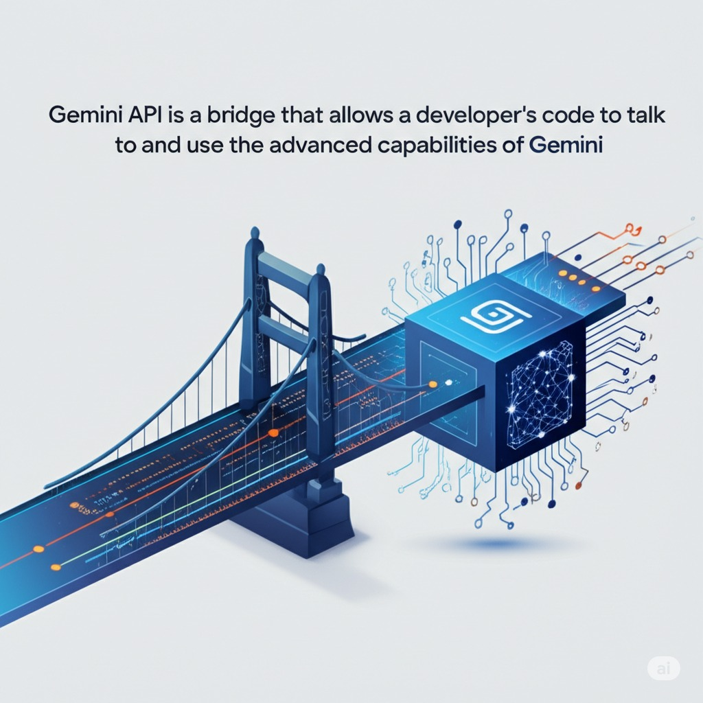

You can build apps that can:

* **Understand and generate text:** From writing emails to summarizing long documents.
* **Analyze images and videos:** Identify objects, describe scenes, and answer questions about visual content.
* **Process audio:** Transcribe spoken words and understand audio cues.
* **Write code:** Generate code in various programming languages.

Essentially, the Gemini API gives developers the tools to integrate the "brain" of Google's most advanced AI into their own creations.

## **Prerequisites**

Before starting this workshop, ensure you have:

- A Google Account (for accessing [Google AI Studio](https://aistudio.google.com/)).
- Laptop with a modern web browser.
- A stable internet connection

## Exploring Google AI Studio

Sign in with your Google account into [Google AI Studio](https://aistudio.google.com/)

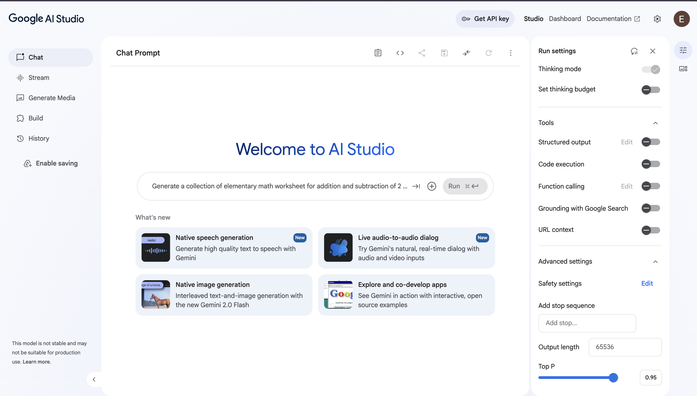

The vertical panel on the left side of the interface is where you choose the type of prompt you want to create and access your past work.

- **Chat**: This is the selected mode, designed for creating conversational AI experiences.
- **Stream**: Stream real-time with Gemini.
- **Generate Media**: A new feature for creating content beyond text.
- **Build**: Build apps with Gemini.
- **History**: This tab allows you to view and revisit your previously saved prompts and conversations.

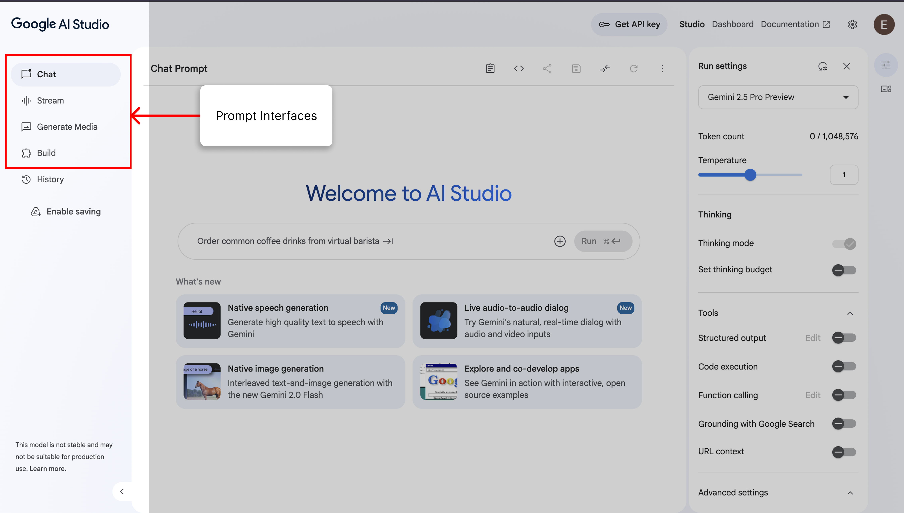

### Chat Prompt

This prompt interface is the primary space where you interact with the AI.

- **Prompt Input Box:** This is where you type your instructions for the AI. To the right of the input box are buttons to add different types of input (like images, videos, files, audio) and the main **Run** button to send your prompt to the model.


The panel on the right gives you fine-grained control over how the AI model responds.

- **Model Selector:** The dropdown at the top allows you to choose which AI model to use.
- **Token count:** This shows the number of tokens your input is using out of the model's maximum context window.
- **Temperature:** A slider that controls the randomness of the output. A lower temperature (closer to 0) makes the output more deterministic and focused, while a higher temperature (closer to 1) makes it more creative and diverse.
- **Thinking:** This section includes a "Thinking mode" toggle and a "Set thinking budget," which allows the model more processing time for complex queries.
- **Tools:** This section allows you to give the model additional capabilities:
  - **Structured output:** Guide the model to respond in a specific format (like JSON).
  - **Code execution:** Allow the model to run code to solve problems.
  - **Function calling:** Enable the model to interact with external tools and APIs.
  - **Grounding with Google Search:** Connect the model to Google Search to provide answers based on real-time, verifiable information from the web.
- **URL context:** Lets you provide a URL as context for your prompt.
- **Advanced settings:** A collapsible menu for even more detailed configuration options.

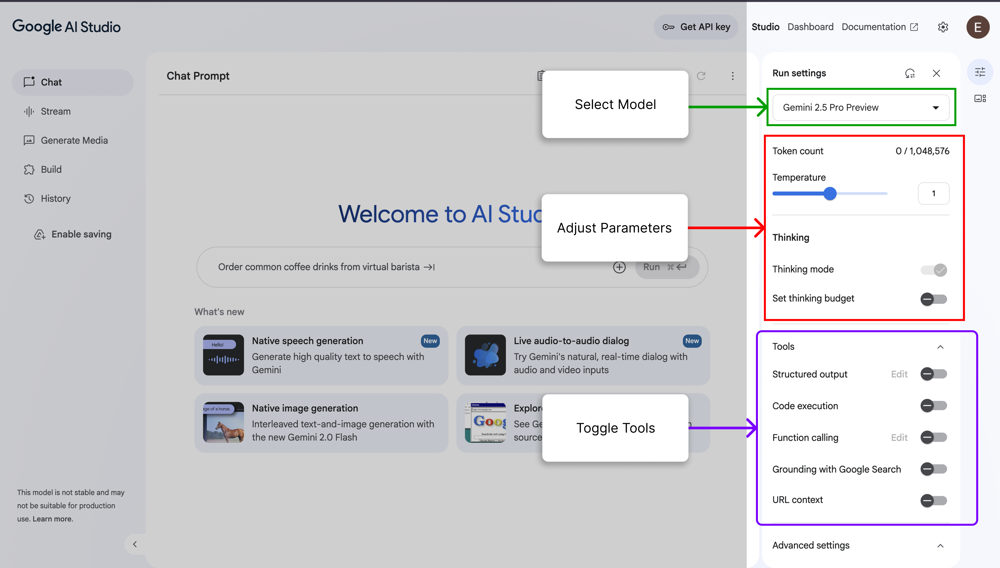

### Stream Realtime

The stream interface enables live, real-time conversations with Gemini. It lets you use your voice, webcam, and screen for a direct, continuous, multimodal dialog.

- **Prompt/Input Area:** A subtle input box says "Start typing a prompt," but the primary focus is on the multimodal input buttons below it:
  - **Talk:** Click this to use your microphone and speak directly to Gemini.
  - **Webcam:** Click this to activate your camera and provide visual input.
  - **Share Screen:** Click this to share your screen's content as a visual input for the model.
- **Run Button:** The "Run" button to the right initiates the interaction once your inputs are ready.

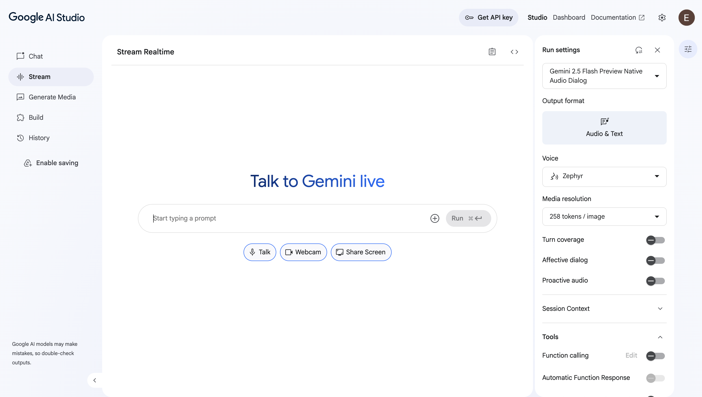

The right panel contains a new set of controls specifically tailored for the "Stream Realtime" audio dialog mode.

- **Output format:** Output format the model should respond with.
- **Voice:** A dropdown menu lets you choose the AI's voice persona.
- **Media resolution:** This controls the quality (and token cost) of any visual information sent to the model.
- **Advanced Conversational Toggles:**
  - **Turn coverage:** Keeps audio and video active even when no speech is detected.
  - **Affective dialog:** Adjusts responses based on the user’s tone and expression.
  - **Proactive audio:** Ignores audio that isn’t relevant to the conversation.
- **Session Context:** Uses a sliding window to trim older messages and manage chat history automatically.
- **Tools:**
  - **Function calling:** Allows the model to use external tools or APIs to perform actions or get information.
  - **Automatic Function Response:** Allows the model to automatically execute a function call without waiting for explicit user approval.

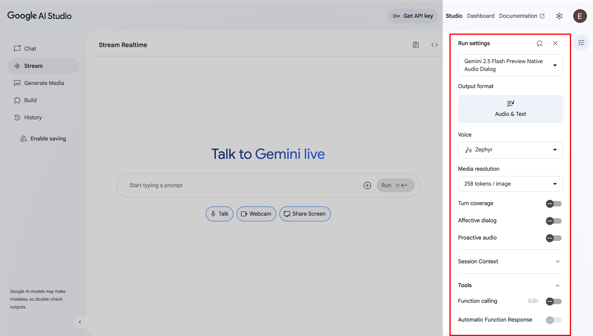

### Generate Media

This is where you can create content beyond text, select your model of choice, add a prompt and generate your media. The Imagen model can be used to to generate high quality images across multiple aspect ratios, while Veo can be used to animate images and create video clips.

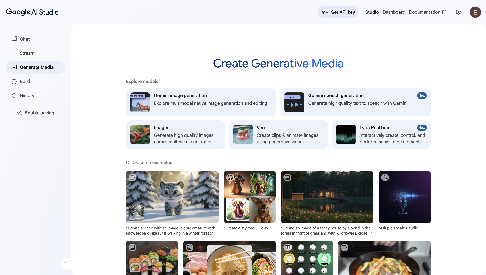

### Build

This section is a developer-focused playground and workbench designed for prototyping and creating applications powered by Google's Gemini family of AI models.

In essence, it's all about:

* **Rapid Experimentation:** It allows developers to quickly start building by either describing an app in natural language (e.g., "an image generator that uses imagen") or by starting from pre-built templates.
* **Showcasing Capabilities:** The "Showcase" section features a gallery of ready-made example apps. This demonstrates the wide range of what's possible with Gemini, including: audio generation, image interaction and productivity tools.
* **Access to Multimodal Models:** It provides access to a suite of different models tailored for specific tasks, such as `Gemini 2.5 Pro`, `Imagen` for images, and `Lyria` for music, allowing developers to use the best tool for the job.
* **Personal Workspace:** It includes sections like "Your apps" and "Recent apps," where users can save, manage, and continue working on their own creations within the studio.

It's an interactive environment meant to lower the barrier to entry for AI development, enabling creators to easily explore, build, and test the advanced multimodal capabilities of Gemini.

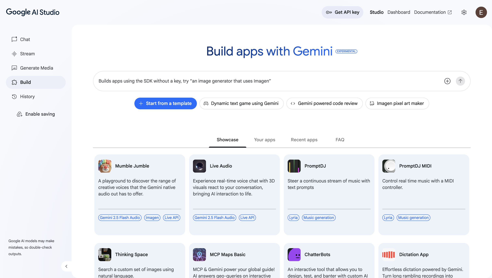

## Prompting

#### **1. Basic Code Generation**

**Prompt:**

```md
Write a Python function that prints "Hello World!"
```

#### **2. Debugging + Error Explanation**

**Prompt:**

```md
Explain the error in this Python code and fix it:

def divide(a, b):
    return a / b

print(divide(10, 0))
```

#### 3 Temperature Setting

**Prompt with temperature set at 0:**

```md
Generate 5 names for a brand of coffee that is exclusively for software developers.
```

**Prompt with temperature set at 2:**
```md
Generate 5 names for a brand of coffee that is exclusively for software developers.
```


#### **4. Structured Output**

Turn on the **Structured Output** tool.

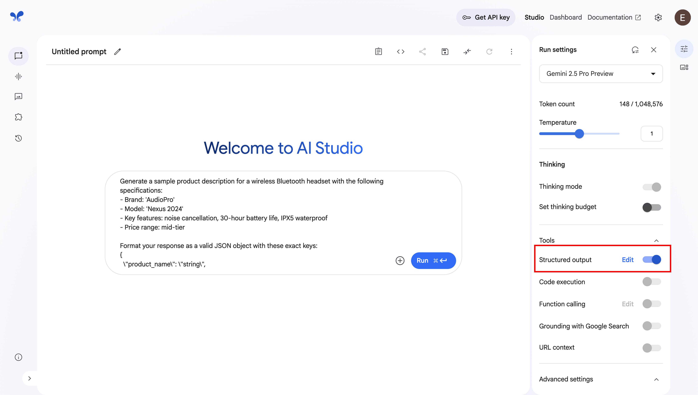

**Prompt:**  

```md
Generate a sample product description for a wireless Bluetooth headset with the following specifications:  
- Brand: 'AudioPro'  
- Model: 'Nexus 2024'  
- Key features: noise cancellation, 30-hour battery life, IPX5 waterproof  
- Price range: mid-tier  
```

Structured output JSON format:
```json
{
  "type": "object",
  "properties": {
    "product_name": {
      "type": "string"
    },
    "target_audience": {
      "type": "string"
    },
  }
}
```

#### **5. Grounding with Google Search**

**Prompt:**

```
Whats the latest React version?
```

Outdated result:

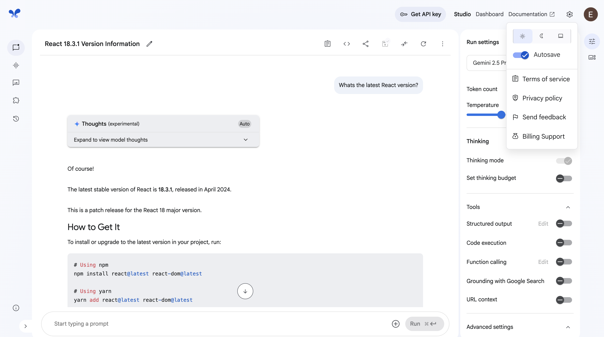

Turn on **Grounding with Google Search** tool.

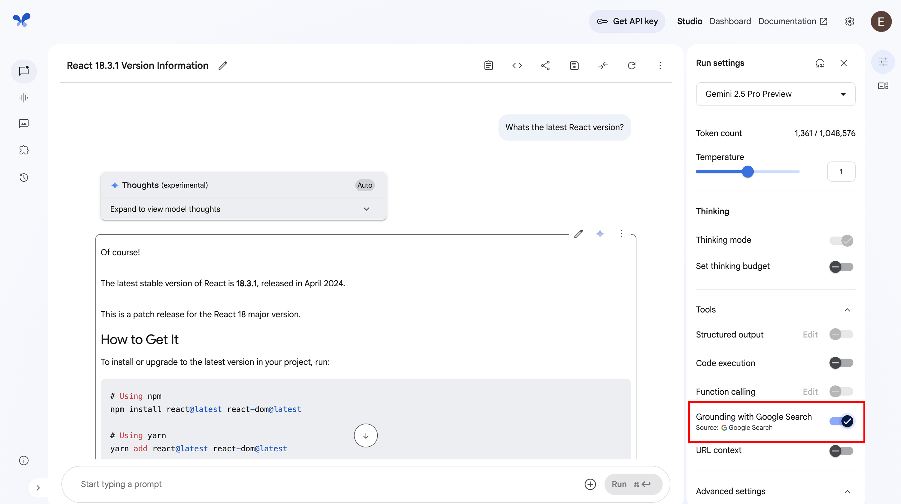

Updated result:

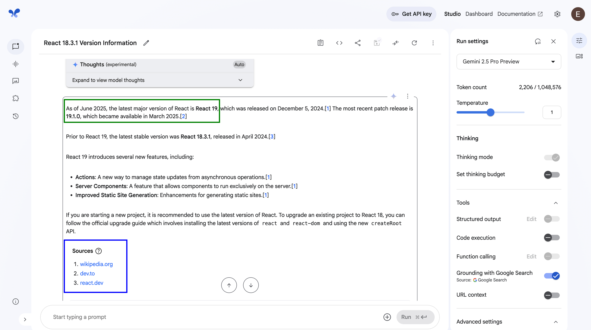

#### 6. Image and Text Prompt

Choose a random image and prompt:

```md
Can you summarize what is in the this image?
```

#### **6. Using System Instructions**

System Instruction:

```md
You're a sarcastic joker
```

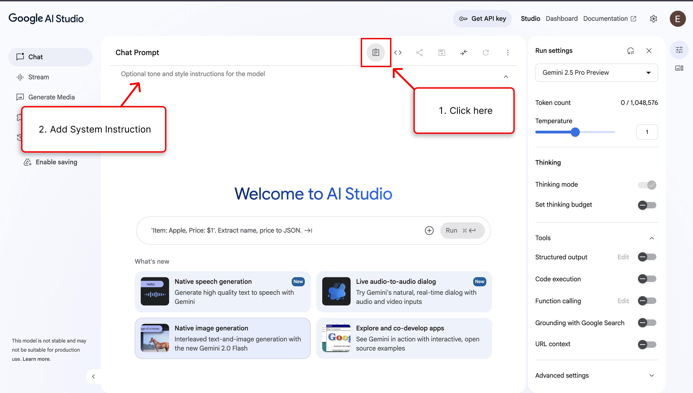

**Prompt:**

```
What is photosynthesis?
```

## Build an AI Recipe Generator

Prompt:

```md
Build a recipe generator app that takes a list of ingredients and generates a recipe with visually appealing images.
```
After the model generates the app, you can add new features to the app and also inspect the code.
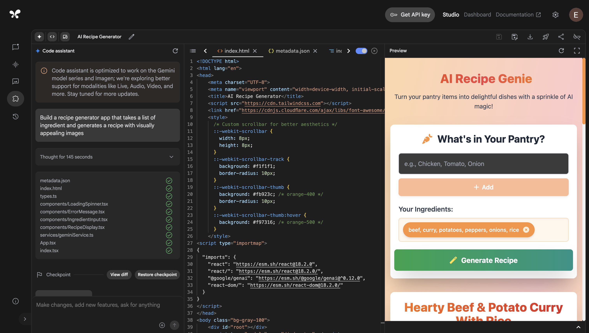

This is the final product the model generated:

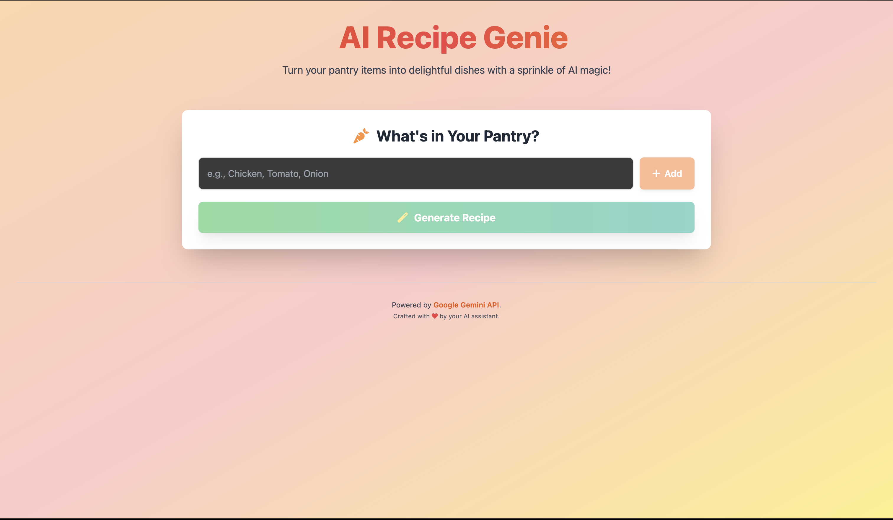

## Conclusion

In this hands-on session, we explored Google AI Studio and the Gemini API. We started by exploring the AI Studio interface, learning how to fine-tune models and adjust settings for optimal results. Through practical exercises, we mastered various prompting techniques, from basic queries to advanced multimodal inputs.  

The highlight was building our AI recipe generator, taking ingredients as input and generating complete recipes with visual appeal. This demonstrated Gemini’s capabilities in content creation and API integration.  

Remember: effective prompting and proper model configuration are key to unlocking Gemini’s full potential. We encourage you to apply these techniques to your own projects.  

For further learning, visit the [Gemini API documentation](https://ai.google.dev/) and continue experimenting in [AI Studio](https://aistudio.google.com).  

Thank you for participating!  